# Eisai Matcha
## Elevate your senses with matcha.

At Eisai Matcha, our business model is all about bringing premium, ceremonial-grade matcha from Japan straight to your doorstep. We partner with trusted farms to deliver fresh, vibrant matcha with authentic flavor. By keeping things simple and direct, we’re able to focus on what matters most—quality you can taste and a shopping experience that feels effortless. Alongside our matcha, we also offer beautifully crafted kits and equipment to help you prepare it the way it’s meant to be enjoyed. Whether matcha is part of your daily ritual or a moment of calm in your week, we’re here to make it easy and enjoyable to get the good stuff, anytime you want it.

[Link to site](https://eisai-matcha-05ff09384237.herokuapp.com/) 
[Link to repository](https://github.com/MCamish29/eisaimatcha.git)  
_To open links in a new tab, hold CTRL + Click_

# Table of Contents

- [Wireframe](#wireframe)
- [Design](#design)
- [Features](#features)
- [Installation](#installation)
- [Database](#database)
- [Testing](#testing)
- [Validation](#validation)
- [Deployment](#deployment)
- [Technologies Used](#technologies-used)
- [Acknowledgments](#acknowledgments)

# WireFrame

#### Home page
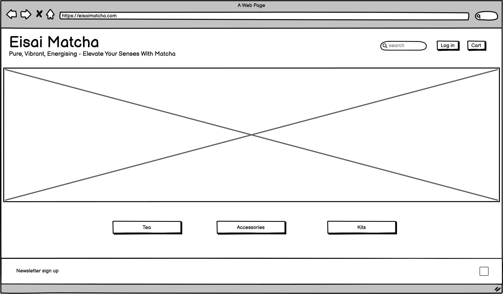

#### Products page
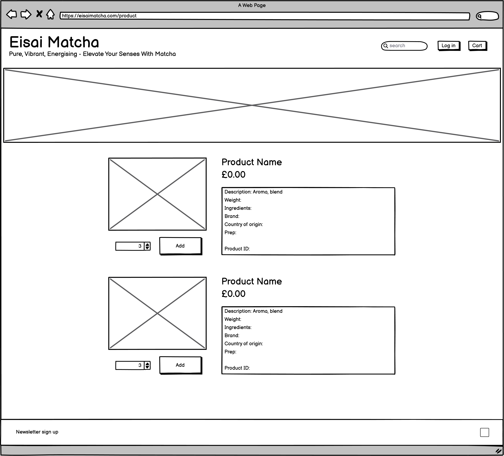

#### Add product page
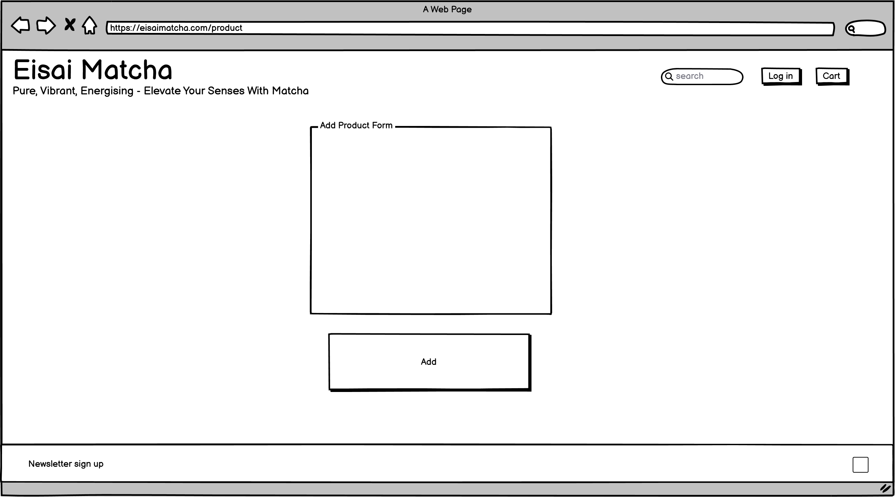

#### Edit product page

#### Bag page
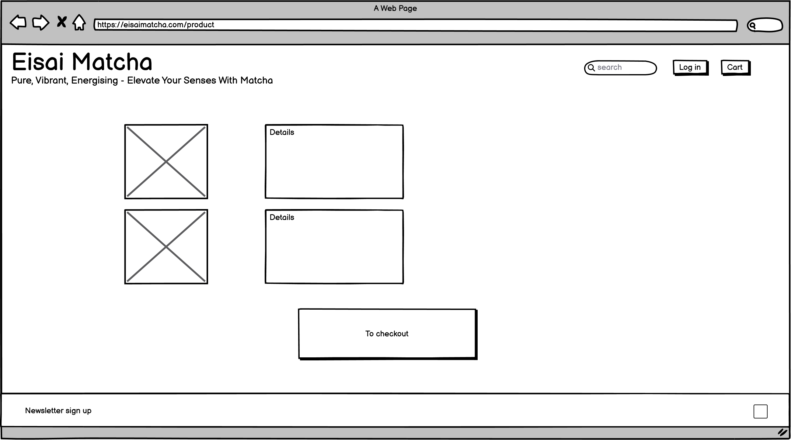

#### Checkout page
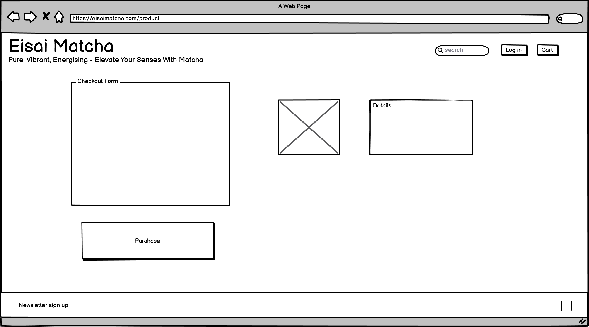

# Design

The design of Eisai Matcha reflects the clean, calm, and minimalist essence of Japanese tradition. A grayscale color palette was intentionally chosen to convey sophistication and tranquility, allowing the vibrant colors of the product to stand out on screen.

The name Eisai Matcha honors the Japanese Buddhist monk Eisai, who is credited with introducing matcha to Japan in 1191. After returning from a study trip to China with tea seeds, he advocated for their cultivation and consumption. His efforts laid the foundation for the development of matcha as we know it today.

## Features
### User Experience
The website provides a smooth and intuitive experience for customers. Users can easily navigate through various categories, select their desired products, add items to their shopping bag, and complete a straightforward checkout process. After placing an order, customers receive an order confirmation.

### Admin Functionality
Admins enjoy the same user-friendly navigation with added functionality. They can:

- Add new products directly from the front end
- Edit existing product details
- Delete products from the site

This allows for efficient, real-time content management without needing to access a backend dashboard.

### User Accounts
All users—whether customers or admins—can log in to their accounts for a personalized experience and access to relevant features.

- Homepage with navigation.
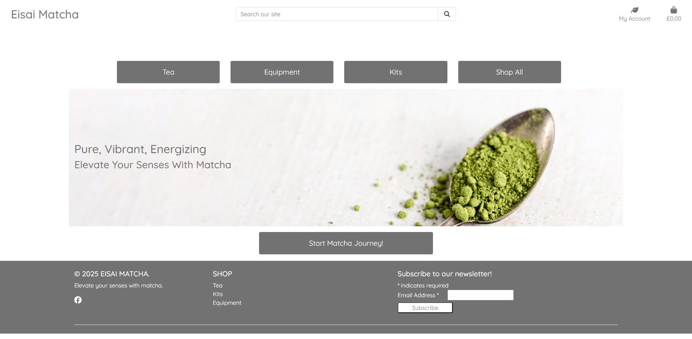
_A home page to welcome customers with easy navigation:_ 
[Home page](https://github.com/users/MCamish29/projects/6/views/1?pane=issue&itemId=105767890&issue=MCamish29%7Ceisaimatcha%7C4)

- Products page.
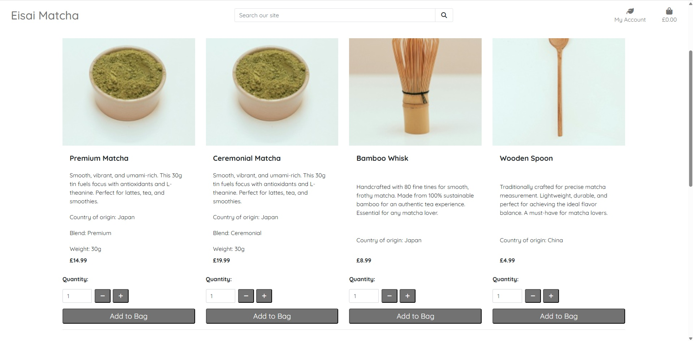
_A products page to showcase what is available for purchase:_ 
[Products page](https://github.com/users/MCamish29/projects/6/views/1?pane=issue&itemId=105767890&issue=MCamish29%7Ceisaimatcha%7C4)

- Bag page.
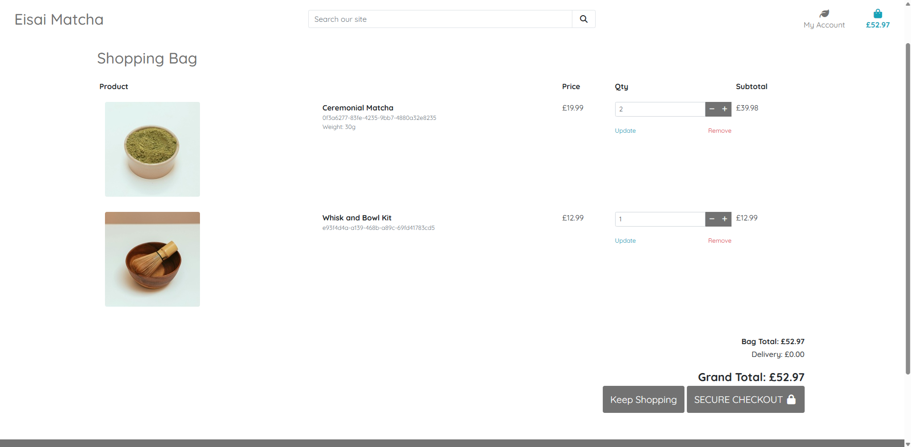
_A bag page to showcase what the visitor is going to purchase or make amendments to:_ 
[Bag page](https://github.com/users/MCamish29/projects/6/views/1?pane=issue&itemId=105767952&issue=MCamish29%7Ceisaimatcha%7C5)

- Checkout page.
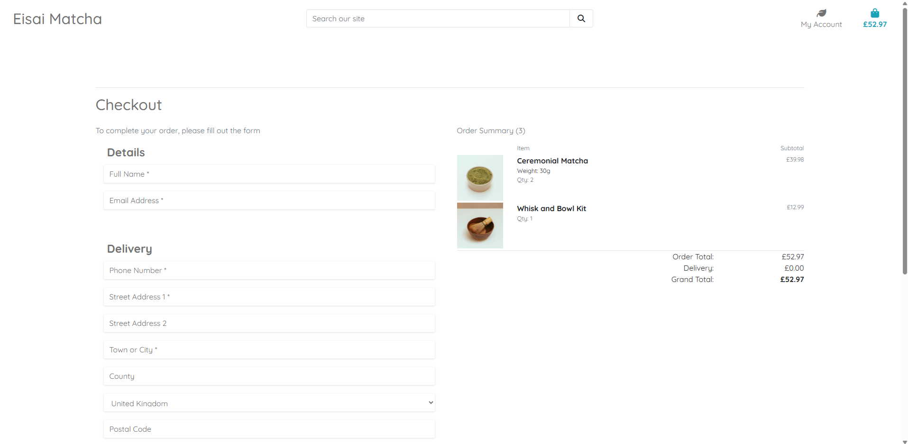
_A checkout page to allow the visitor to complete their transaction:_ 
[Checkout page](https://github.com/users/MCamish29/projects/6/views/1?pane=issue&itemId=105767952&issue=MCamish29%7Ceisaimatcha%7C5)

- Admin front end products page.
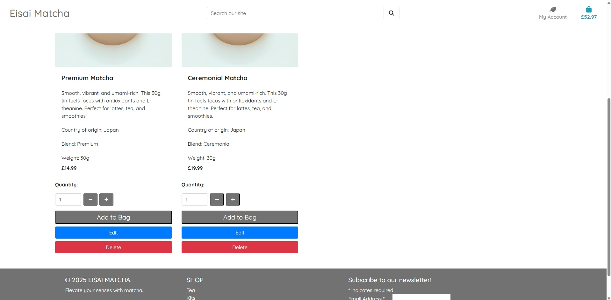
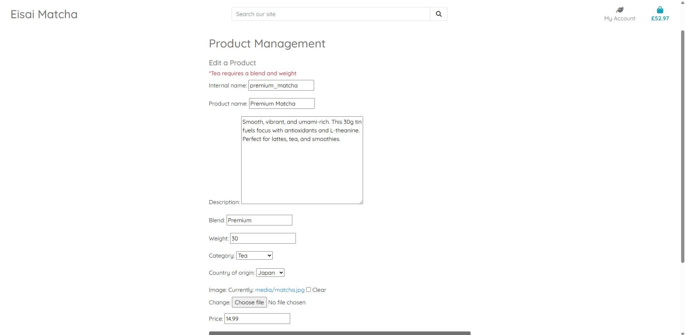
_A page to edit products for the admin of site:_ 
[Admin edit page](https://github.com/users/MCamish29/projects/6/views/1?pane=issue&itemId=105768168&issue=MCamish29%7Ceisaimatcha%7C9)

_A delete button on products for the admin of site:_ 
[Admin delete page](https://github.com/users/MCamish29/projects/6/views/1?pane=issue&itemId=105768217&issue=MCamish29%7Ceisaimatcha%7C10)

- Django admin page.
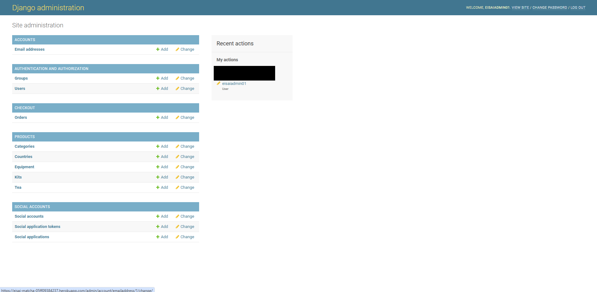

- Facebook social page
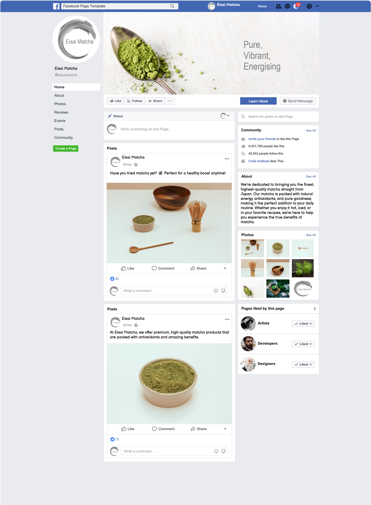

## Future enhancements
The site allows for future enhancements on the customer and admin side. 

Admin:
- Implementing partial forms throughout the site will enable controlled access to specific URLs for visitors.
- If the business expands beyond tea, kits, and equipment, refining the current models can help streamline and improve the back-end experience.
- As the number of products and pages grows, introducing a front-end admin dashboard would enhance efficiency and make content management more intuitive.

Customer:
- Like most e-commerce platforms, providing access to customer terms and conditions and FAQs offers a quick source of information, improving the overall user experience.
- A wishlist feature would be a valuable future enhancement, as it indicates customer interest and supports future purchasing decisions based on user engagement data.
- Adding a ratings and reviews section would help build trust with potential customers and support confident purchasing decisions.
- Personalized product recommendations tailored to individual users can significantly improve user experience and increase conversion rates.

 

# Installation

## Clone the Repository

### 1. Clone the repository
Clone the GitHub repository to your local machine : [Link to repository](https://github.com/MCamish29/eisaimatcha.git)

### 2. Install dependencies
pip install -r requirements.txt

### 3. Apply migrations
python manage.py migrate

### 4. Run server
python manage.py runserver

## Forking

To make changes or contribute, fork the repository to your GitHub account by clicking the "Fork" button on the repository page : [Link to repository](https://github.com/MCamish29/eisaimatcha.git)

### Prerequisites

Make sure you have the following installed:

- Django==3.2.25
- django-allauth==0.50.0
- django-countries==7.2.1
- django-crispy-forms==1.14.0
- django-storages==1.14.6
- gunicorn==23.0.0
- pillow==10.3.0
- psycopg2==2.9.10
- boto3==1.37.28

You can install them via `pip3` 
Packages must be added to requirements.txt `pip3 freeze --local > requirements.txt`

## Deployment

1. Log in to Heroku or create account
2. Click the **new** button on the top right to display drop down
3. Select **create new app**
4. Enter app name - *this must be a unique name*
5. Choose relevant region
6. Click **create app**
7. On the application dashboard select **settings**
8. Scroll down to *Config Vars*
9. Click on **Reveal_Config vars**
10. Enter **DATABASE_URL**
11. Click add
12. Enter **Cloudinary API**
13. Click add
14. Enter **Secret Key**
15. Click add
16. Select **deploy** at the top of the application dashboard
17. Select **GitHub** as deployment method
18. Search for repository name and click **connect**
19. Scroll down and select either **Enable Automatic Deploys** or **Deploy Branch** for manual deployment.
20. This will then run the process to deploy the application
21. Click on **View** once successfully deployed

# Database

## Entity-Relationship Diagram (ERD)

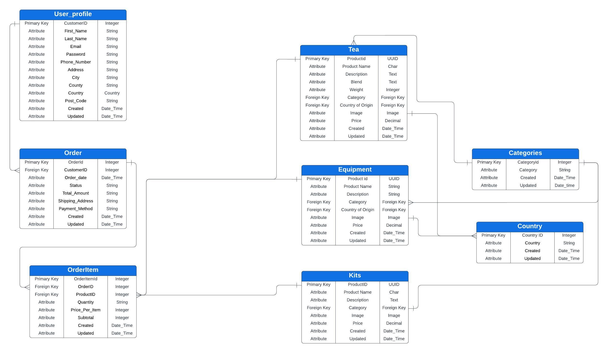

 

# Testing 

| User                                                          | Test                                               | Steps                                                                                                                                                                                      | Expected Result                                                                                                                                                                                                                                                                                                                                                                                                                    | Result |
| ------------------------------------------------------------- | -------------------------------------------------- | ------------------------------------------------------------------------------------------------------------------------------------------------------------------------------------------ | ---------------------------------------------------------------------------------------------------------------------------------------------------------------------------------------------------------------------------------------------------------------------------------------------------------------------------------------------------------------------------------------------------------------------------------- | ------ |
| Site visitor anonymous/ Site visitor with account/ Site Admin | Home page displays from URL                        | 1\. Open browser 2\. Type URL into address bar : https://eisai-matcha-05ff09384237.herokuapp.com/ 3\. Press Enter                                                                    | The home page loads with its contents, including the navigation bar and footer.                                                                                                                                                                                                                                                                                                                                                    | Pass   |
| Site visitor anonymous/ Site visitor with account/ Site Admin | Navigating across product pages                    | 1\. Click on "Tea" button 2\. Click on the "Kits" button 3\. Click on the "Equipment" button 4\. Click on the "Shop All" button 5\. Click on the "Start Matcha Journey" button | Clicking on the specific buttons of "Tea", "Kits", and "Equipment " will redirect the site visitor to these specific categories, whilst clicking on "Shop All" and "Start Matcha Journey!" the site visitor is redirected to all products in all categories.                                                                                                                                                                       | Pass   |
| Site visitor anonymous/ Site visitor with account/ Site Admin | Navigating across product pages from footer        | 1\. Click on "Tea" 2\. Click on the "Kits" 3\. Click on the "Equipment"                                                                                                           | Clicking on "Tea", "Kits", and "Equipment " within the footer will redirect the site visitor to these specific categories.                                                                                                                                                                                                                                                                                                         | Pass   |
| Site visitor anonymous/ Site visitor with account/ Site Admin | Increasing and descresing quantity in product page | 1\. Click on the increment or decrement buttons                                                                                                                                            | Clicking on the "+" button will increase the quantity number  by 1 and clicking on "-" will decrease the quantity number by 1 but not allowing to go below 1                                                                                                                                                                                                                                                                       | Pass   |
| Site visitor anonymous/ Site visitor with account/ Site Admin | Adding products to bag                             | 1\. Click "Add to Bag" button under product                                                                                                                                                | Clicking on the "Add to Bag" button under the product will add the relevant product to the bag adjusting the value of the bag and redirec the visitor to all products to showcase website offerings. Success toast message will appear                                                                                                                                                                                          | Pass   |
| Site visitor anonymous/ Site visitor with account/ Site Admin | Viewing bag with no items in the bag               | 1\. Click on bag icon                                                                                                                                                                      | Clicking on the bag icon will redirect the visitor to a blank bag page with a button to return to the products page                                                                                                                                                                                                                                                                                                                | Pass   |
| Site visitor anonymous/ Site visitor with account/ Site Admin | Viewing bag with items in the bag                  | 1\. Click on bag icon                                                                                                                                                                      | Clicking on the bag icon will redirect the visitor to the bag page showcasing the  products selected for purchase with options to adjust quantity, remove from bag, keep shopping, and a button to secure checkout                                                                                                                                                                                                                 | Pass   |
| Site visitor anonymous/ Site visitor with account/ Site Admin | Adjusting quantity in the bag                      | 1\. Click on the increment or decrement buttons 2\. Click update                                                                                                                        | Clicking on the "+" button will increase the quantity number  by 1 and clicking on "-" will decrease the quantity number by 1 but not allowing to go below 1. Upon clicking update the quantity will reflect the desired quantity for the relevant product updating the subtotal, bag total, delivery, and grand total. Success toast message will appear                                                                       | Pass   |
| Site visitor anonymous/ Site visitor with account/ Site Admin | Returning the shop from bag                        | 1\. Click on "Keep Shopping" button                                                                                                                                                        | Clicking on the "Keep Shopping" button in the bag either with or without items in the bag will return the visitor to the all products page.                                                                                                                                                                                                                                                                                        | Pass   |
| Site visitor anonymous/ Site visitor with account/ Site Admin | Viewing bag from toast message                     | 1\. Add a product to the bag 2\. Click on "Go to secure checkout" in toast message                                                                                                      | Clicking on the "Go to Secure Checkout" in toast message will redirect visitor the the bag page display products added to bag                                                                                                                                                                                                                                                                                                      | Pass   |
| Site visitor anonymous/ Site visitor with account/ Site Admin | Removing item from bag with other items in bag     | 1\. Click "Remove" when on bag page                                                                                                                                                        | Clicking remove on bag page will remove the relevant product from bag, updating the bag total, delivery and grand total Success toast message will appear                                                                                                                                                                                                                                                                       | Pass   |
| Site visitor anonymous/ Site visitor with account/ Site Admin | Removing item from bag with no other items in bag  | 1\. Click "Remove" when on bag page                                                                                                                                                        | Clicking remove on bag page will remove the relevant product from bag displaying an empty bag page with the "Keep Shopping" button to redirect the visitor                                                                                                                                                                                                                                                                         | Pass   |
| Site visitor anonymous/ Site visitor with account/ Site Admin | Viewing checkout page                              | 1\. Click "Secure Checkout" on the bag page                                                                                                                                                | Clicking on the "Secure Checkout" button when on the bag page will redirect the visitor to the secure checkout page. This will display a form to fill in required delivery details and card payment details whilst showcasing products that are being purchased                                                                                                                                                                    | Pass   |
| Site visitor anonymous/ Site visitor with account/ Site Admin | Completing checkout process                        | 1\. Complete form with required person details 2\. Complete the delivery details, required fields at a minimum 3\. Complete payment details 4\. Click "Complete Order" button     | Upon entering the required fields and clicking the "Complete Order" button the user will be redirected to an order success page show casing the confirmation and order details advising an email has been sent as well. Success toast message will appear.                                                                                                                                                                      | Pass   |
| Site visitor anonymous/ Site visitor with account/ Site Admin | Opening social media page                          | 1\. Click on the Facebook icon on the footer                                                                                                                                               | Clicking on the Facebook icon will open Facebook in a new tab                                                                                                                                                                                                                                                                                                                                                                      | Pass   |
| Site visitor anonymous/ Site visitor with account/ Site Admin | Returning to home page from other pages            | 1\. Click on Eisai Matcha in header                                                                                                                                                        | Clicking on the "Eisai Matcha" in the header will redirect the visitor to the homepage                                                                                                                                                                                                                                                                                                                                             | Pass   |
| Site visitor anonymous                                        | Viewing page to register for an account            | 1\. Click on "My Account" 2\. Click on "Register"                                                                                                                                       | Clicking on "My Account" will display a drop down menu containing "Register" and "Log In". Upon clicking "Register" the visitor will be redirected to a sign up page                                                                                                                                                                                                                                                               | Pass   |
| Site visitor anonymous                                        | Registering for an account                         | 1\. Enter all required information in form 2\. Click "Sign Up"                                                                                                                          | Upon entering the required fields and clicking the "Sign Up" button the visitor will have registered their account and be redirected to a verify your account page notifying the visitor to check their emails. Information toast message will display                                                                                                                                                                          | Pass   |
| Site visitor anonymous                                        | Verifying account                                  | 1\. Open email from the site 2\. Click "Confirm"                                                                                                                                        | Upon clicking the link in the email the visitor will be redirected to a confirm page where they will click confirma nad be redirected to the log in page                                                                                                                                                                                                                                                                           | Pass   |
| Site visitor anonymous/ Site visitor with account/ Site Admin | Viewing page to log into an account                | 1\. Click on "My Account" 2\. Click on "Log In"                                                                                                                                         | Clicking on "My Account" will display a drop down menu containing "Register" and "Log In". Upon clicking "Log In" the visitor will be redirected to a log in page                                                                                                                                                                                                                                                                  | Pass   |
| Site visitor anonymous/ Site visitor with account/ Site Admin | Logging into an account                            | 1\. Enter verified email address 2\. Enter password 3\. Click sign in                                                                                                                | Upon entering the required fields and clicking the "Sign In" button the visitor will be redirected to the home page to being shopping Success toast message will display                                                                                                                                                                                                                                                        | Pass   |
| Site visitor anonymous/ Site visitor with account/ Site Admin | Viewing page to log out of an account              | 1\. Click on "My Account" 2\. Click on "Log out"                                                                                                                                        | Clicking on "My Account" will display a drop down menu containing "My Profile" and "Log Out". Upon clicking "Log Out" the visitor will be redirected to a log out confirmation page                                                                                                                                                                                                                                                | Pass   |
| Site visitor anonymous/ Site visitor with account/ Site Admin | Logging out of an account                          | 1\. Click on "Sign Out" button                                                                                                                                                             | Clicking on the "Sign Out" button will redirect the visitor to the home page. Success toast message will appear                                                                                                                                                                                                                                                                                                                 | Pass   |
| Site visitor anonymous/ Site visitor with account/ Site Admin | Viewing Profile Page                               | 1\. Click on "My Account" 2\. Click on "My Profile"                                                                                                                                     | Clicking on "My Account" will display a drop down menu containing "My Profile" and "Log Out". Upon clicking "My Profile" the visitor will be redirected to their profile page showcasing a form for default delivery information and order history                                                                                                                                                                                 | Pass   |
| Site visitor anonymous/ Site visitor with account/ Site Admin | Updating default delivery information              | 1\. Complete form with relevant information 2\. Click "Update Information" button                                                                                                       | Upon entering the required fields and clicking "Update Information" button will save the newly entered information for the site visitor's next purchase. Success toast message will appear                                                                                                                                                                                                                                      | Pass   |
| Site visitor anonymous/ Site visitor with account/ Site Admin | Viewing order history in profile page              | 1\. Click on "My Account" 2\. Click on "My Profile" 3\. Click on Order Number in order history                                                                                       | Clicking on "My Account" will display a drop down menu containing "My Profile" and "Log Out". Upon clicking "My Profile" the visitor will be redirected to their profile page showcasing a form for default delivery information and order history. Clicking on the order number will redirect the visitor to their order confirmation.                                                                                         | Pass   |
| Site visitor anonymous/ Site visitor with account/ Site Admin | Returning back to profile from order confirmation  | 1\. Click on "My Account" 2\. Click on "My Profile" 3\. Click on Order Number in order history 4\. Click on "Back to profile" button                                              | Clicking on "My Account" will display a drop down menu containing "My Profile" and "Log Out". Upon clicking "My Profile" the visitor will be redirected to their profile page showcasing a form for default delivery information and order history. Clicking on the order number will redirect the visitor to their order confirmation. Then clicking on the "back to profile" the visitor is redirected to their profile page. | Pass   |
| Site Admin                                                    | Viewing edit product page                          | 1\. Click on product cateogry of product to edit 2\. Click on "Edit"                                                                                                                    | Clicking on "Edit" button of relevant product will redirect the site admin to the edit products page                                                                                                                                                                                                                                                                                                                               | Pass   |
| Site Admin                                                    | Editing an existing product                        | 1\. Click on "Edit" of relevant product 2\. Edit required fields 3\. Click "Update Product"                                                                                          | Upon editing product information and clicking on "Update Product" the site admin will then be redirected back to product page showing the changes made. Success toast message will appear                                                                                                                                                                                                                                       | Pass   |
| Site Admin                                                    | Viewing add product page                           | 1\. Click on "My Account" 2\. Click on "Product Management"                                                                                                                             | Clicking on "My Account" will display a drop down menu containing "Product Management", "My Profile", and "Log Out". Upon clicking "Product Management" the site admin will be redirected to add product page                                                                                                                                                                                                                      | Pass   |
| Site Admin                                                    | Adding a new product                               | 1\. Enter new product information in form 2\. Upload image 3\. Click "Add Product"                                                                                                   | Upon entering the product information, uploading an image and clicking "Add Product" the site admin is then redirected to a blank add product page in case they are adding more. Success toast message will appear.                                                                                                                                                                                                             | Pass   |
| Site Admin                                                    | Deleting a product                                 | 1\. Navigate to relevant product 2\. Click "Delete"                                                                                                                                     | After navigating to relevant product that is required to be deleted the site admin will click "Delete" button which will remove the product from the website and database. Success toast message will appear                                                                                                                                                                                                                    | Pass   |
| Site visitor anonymous/ Site visitor with account/ Site Admin | Searching on site                                  | 1\. Enter search terms in search bar 2\. Press enter or click search icon                                                                                                               | After entering the search term and clicking the icon or pressing enter the site visitor will be redirected to a page show casing the products that fit the search query.                                                                                                                                                                                                                                                           | Pass   |

# Validation

### W3C

All HTML pages were passed through [W3C HTML Validator](https://validator.w3.org/) to ensure it met required standards. The HTML pages were all successful when passing the code through from page source.

All CSS pages were passed through [W3C CSS Validation](https://jigsaw.w3.org/css-validator/) successfully.

### PEP8

All Python files were passed through [Code Institute PEP8 Linter](https://pep8ci.herokuapp.com/#) to ensure it met required standards. The only warnings given related to the settings.py file this was due to 4 lines in AUTH_PASSWORD_VALIDATORS being greater than the desired amount of characters, this code was installed by Django on setup.

### JSHint

The Javascript file was passed [JSHint](https://jshint.com/) successfully.

## Bugs

Bugs were found during development of the site and resolved which can be seen on the [Kanban workflow](https://github.com/users/MCamish29/projects/6).

# Technologies Used

* **VSCode** was the code editor used for the project
* **Django** was the framework used throughout the project
* **Python, HTML, CSS, Javascript** was the language used throughout the project
* **Heroku** was used to deploy the application
* **Git** was used to commit code
* **GitHub** was used to store the repo
* **Code Institute Python Linter** was used for python validation
* **W3C** was used for HTML and CSS validation
* **JSHint** was used for Javascript validation
* **AWS** was used to store media and static files
* **Google Fonts** was used for styling
* **Font Awesome** was used for icons across the site

# Acknowledgments

* Thank you to Code Institute for their comprehensive guides and support.
* A big thank you to my Code Institute mentor Graeme Taylor for all his guidance, support and endless counts of knowledge.
* All images were taken from free stock photo website [Pexels](https://www.pexels.com/)